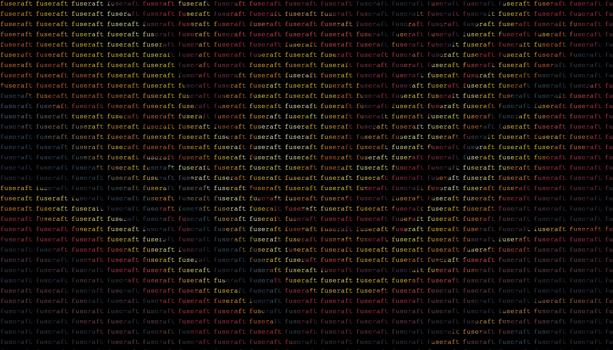

# TextMosaic CLI

TextMosaic is a tool that transforms your images into mosaics made from text.

### Getting Started

Ensure you have Python installed, then install PIL:

```bash
pip install Pillow
```

Download the `textmosaic.py` script or clone this repo:

```bash
git clone https://github.com/fuseraft/textmosaic
cd textmosaic
```

### Usage

To use this script from a terminal, navigate to the directory containing the script and execute the following command:

```bash
python textmosaic.py <input_path> "<text>" <font_path> <font_size> [--output <output>]
```

#### Parameters
- `input_path`: Path to the image file you want to transform.
- `text`: The text string you wish to form the mosaic.
- `font_path`: Path to the `.ttf` font file for the text styling.
- `font_size`: Font size for the mosaic text.
- `output` (optional): Path to save the output image. If not provided, the image will be displayed directly.

#### Examples

To display the image directly:
```bash
python textmosaic.py images/input_003.jpg "hello world" fonts/FreeMono.ttf 20
```

To save the output to a file:
```bash
python textmosaic.py images/input_003.jpg "fuseraft" fonts/FreeMono.ttf 20 --output examples/output.png
```

Example output:



### Contributing

Contributions are welcome! Fork the repository and submit a pull request with your enhancements.

### License

This project is open source and available under the [MIT License](LICENSE).